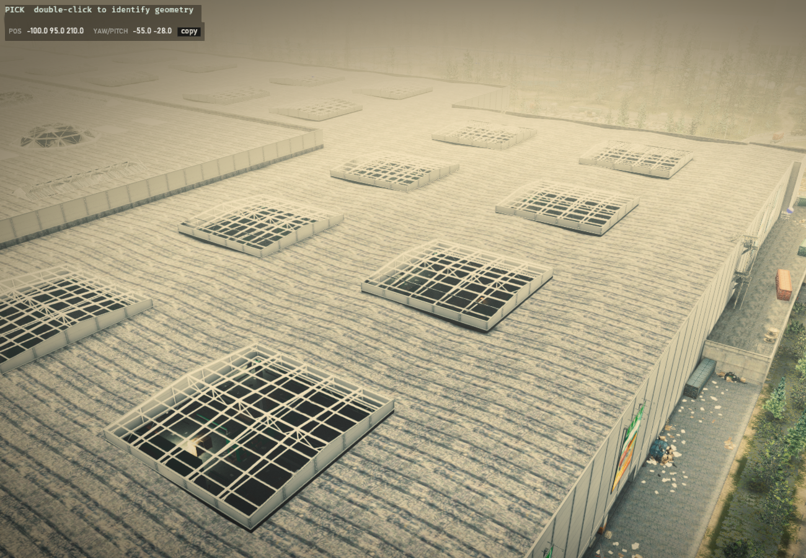
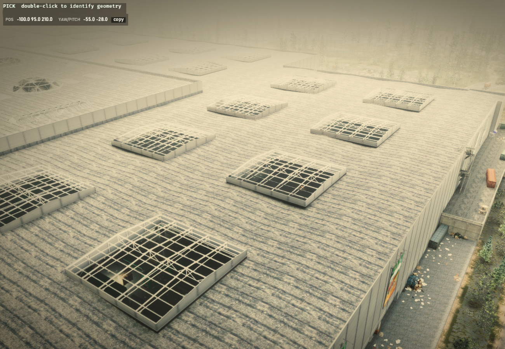
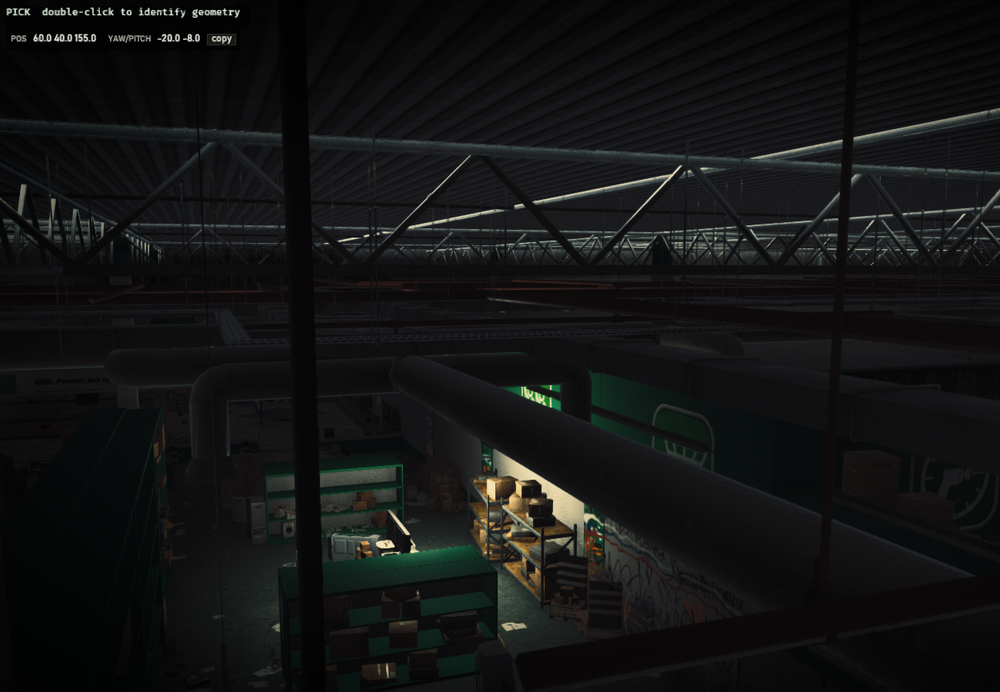
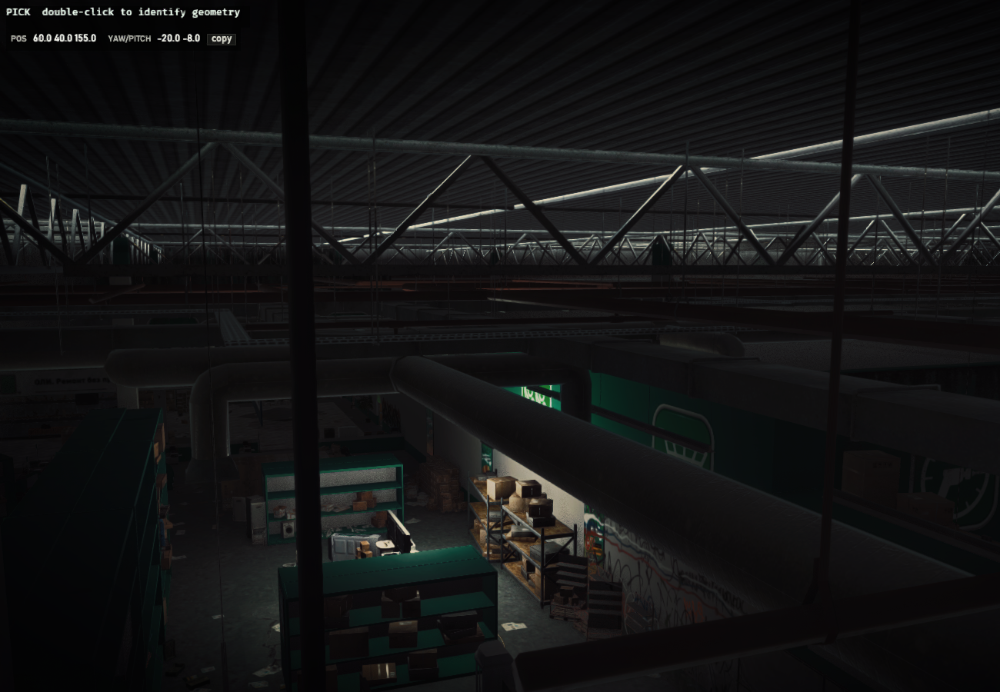
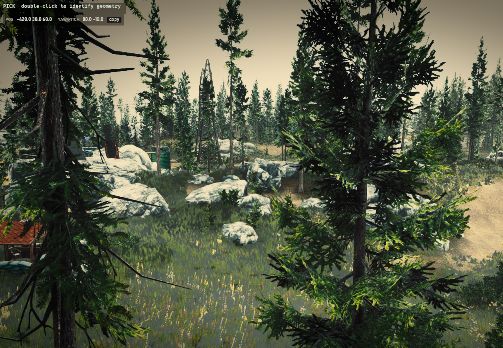
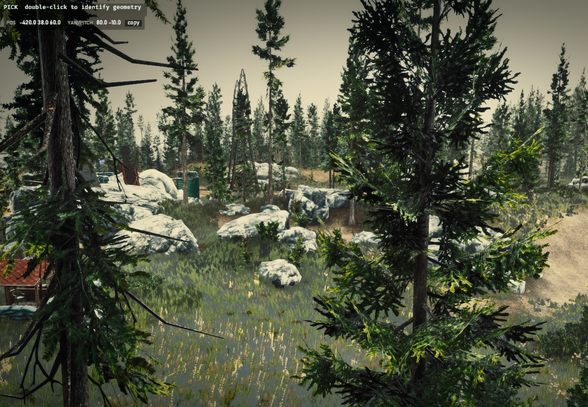
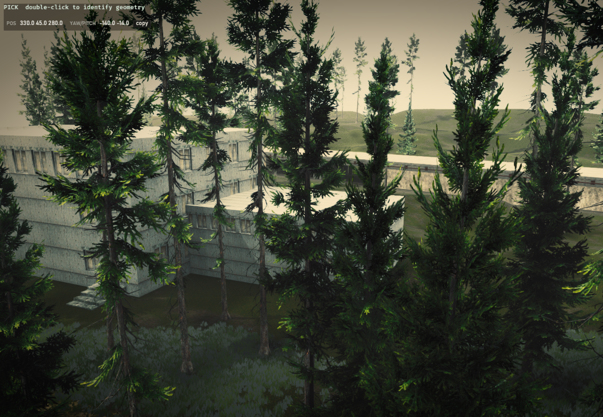
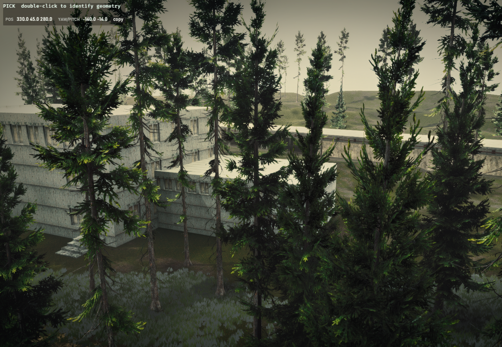
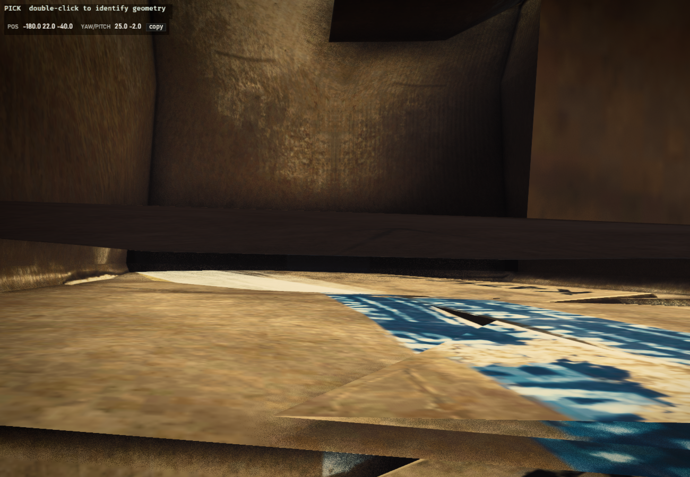
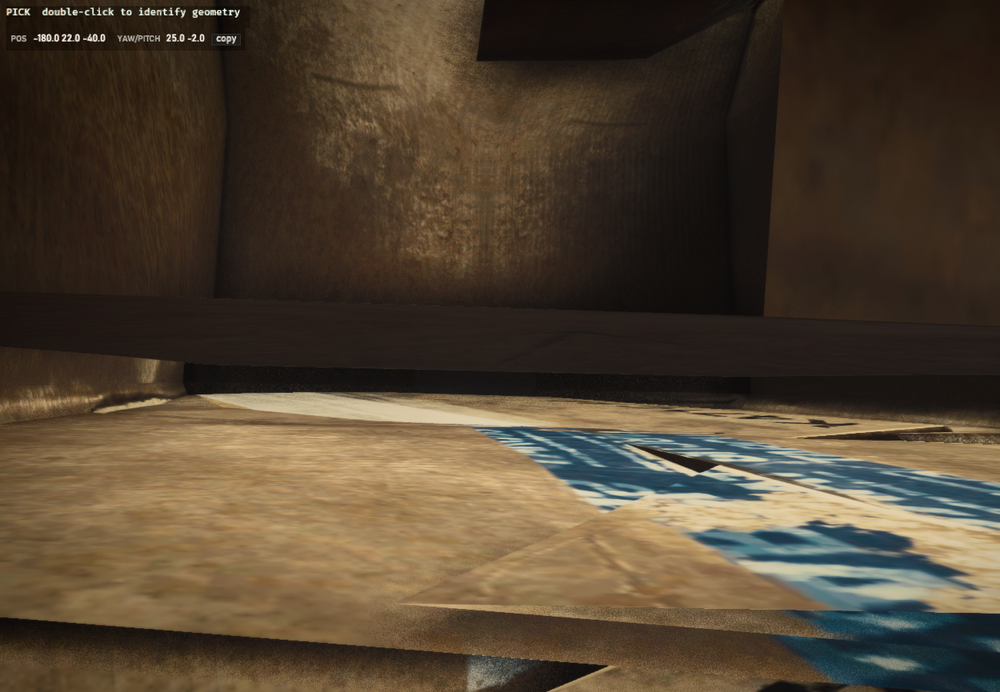

# DLSS 5 Neural Rendering in Atlas — Interchange A/B

Side-by-side captures of Atlas rendering Interchange with and without NVIDIA's
**DLSS 5 "Neural Rendering"** runtime (`nvngx_dlssnr.dll` `310.8.SF`).

Each pair comes from a **single frame**. The RenoDX DLSS5 add-on's `F5` hotkey writes
both halves out of the same evaluation — one with the NR pass applied, one without — so
the two images are pixel-aligned by construction. There is no camera drift, no
re-render, and no toggling between shots.

## How this runs

Atlas is a Rust + Bevy 0.17 / wgpu 26 renderer. It normally runs on **Vulkan**; DLSS 5's
add-on hooks `NVSDK_NGX_D3D12_CreateFeature` / `EvaluateFeature`, so it can only attach to
a **D3D12** device. Getting there needed four changes:

| Blocker | Fix |
|---|---|
| Backend pinned to Vulkan | `EFT_BACKEND=dx12` opt-in hatch |
| `bevy_egui` bindless path declares a bare `u32` push constant — wgpu's HLSL backend rejects it | bindless disabled on DX12 only |
| Startup GPU probe creates and drops a throwaway DXGI factory, which ReShade's proxy cannot survive | probe skipped when the backend is pinned |
| `wgpu-hal` calls `CreateDXGIFactory1(IDXGIFactoryMedia)` unconditionally; ReShade does not wrap that interface and access-violates inside `dxgi.dll` | vendored `wgpu-hal`, skippable via `WGPU_NO_FACTORY_MEDIA=1` |

That last one is upstream and affects **every wgpu/Bevy DX12 app on Windows**, not just Atlas.

The long-standing note in `render/mod.rs` blaming Bevy's `downsample_depth.wgsl` for DX12
turned out to be stale — on wgpu 26 that shader is fine.

```powershell
$env:WGPU_NO_FACTORY_MEDIA='1'; $env:EFT_BACKEND='dx12'; $env:EFT_RENDER='gpu'
$env:EFT_PACK='...\packs\interchange.eftpack'
.\atlas.exe
```

Scene: 7,933 meshes · 3,329,670 instances · 17.5M verts. Captured at 1600×1000,
cropped to 1300×900 to drop the UI side panel.

## Measured difference

Mean absolute per-channel difference between each pair, and the share of pixels that
changed by more than 2/255:

| Scene | mean abs diff | pixels changed |
|---|---|---|
| 01 overview | 5.26 | 86.7% |
| 02 mall front | 1.91 | 25.3% |
| 03 west wing | 5.01 | 86.5% |
| 04 east lot | 4.43 | 73.2% |
| 05 ground level | 4.04 | 72.6% |

## Caveat worth reading before judging

Atlas has no DLSS integration of its own, so this runs through **DLSS5-Feeder**, which
manufactures the NGX contract from ReShade's buffers and takes its motion vectors from
**LumeniteFX** — derived from the colour buffer, not from the engine.

The Feeder's own probe reports those vectors as near-zero on a static camera:

```
[feed] MV probe: mean |mv| 0.000 px, max 0.01 px, 1% non-zero
       <-- DLSS is getting (almost) no motion vectors
```

So this is **not** DLSS 5 at its best. Atlas already computes correct camera-reprojection
motion vectors in `taa.wgsl` from prepass reverse-Z depth; feeding those to NGX directly
would give the model far better input than either this or a typical game integration.
That work is not done here.

Also note NVIDIA's shipping DLSS 5 is *3D-guided* — trained on engine albedo, lighting and
surface normals. The add-on path supplies none of those, so the model is running outside
its designed contract regardless.

## Pairs

### 01 — Overview
| Without DLSS 5 | With DLSS 5 |
|---|---|
|  |  |

### 02 — Mall front
| Without DLSS 5 | With DLSS 5 |
|---|---|
|  |  |

### 03 — West wing
| Without DLSS 5 | With DLSS 5 |
|---|---|
|  |  |

### 04 — East lot
| Without DLSS 5 | With DLSS 5 |
|---|---|
|  |  |

### 05 — Ground level
| Without DLSS 5 | With DLSS 5 |
|---|---|
|  |  |
